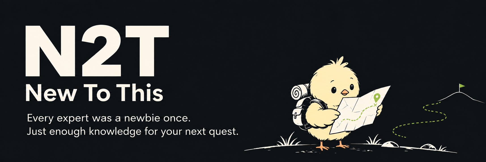
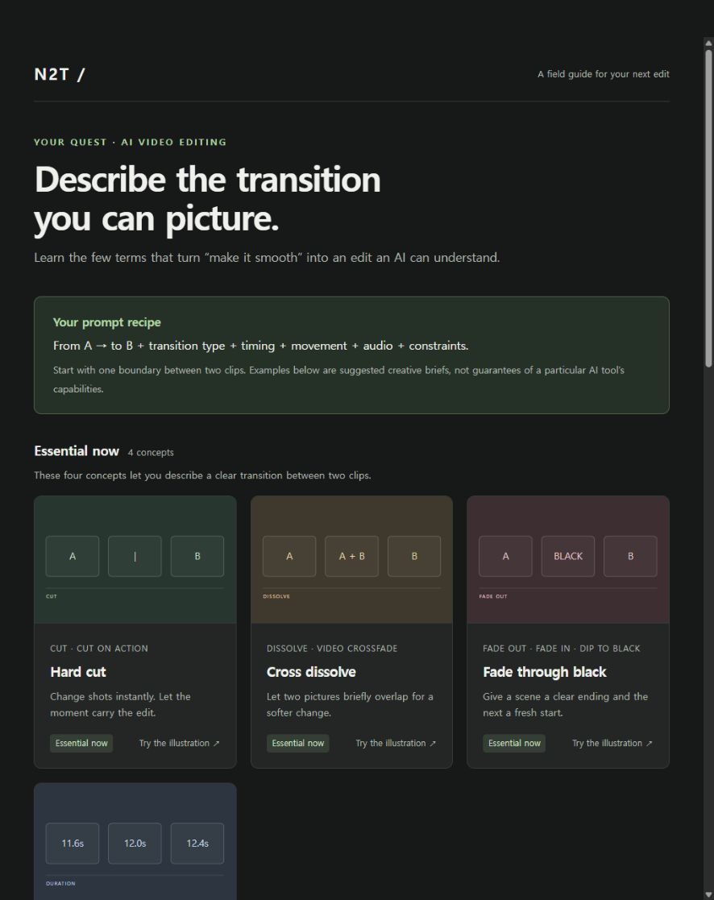
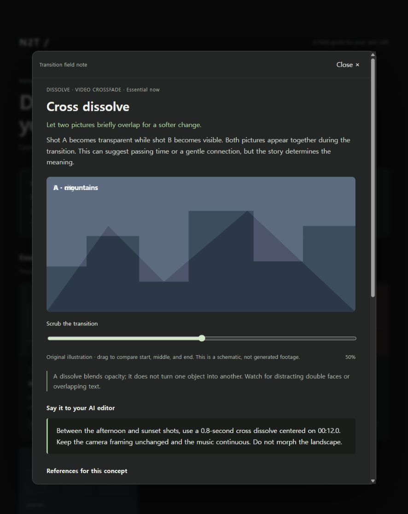
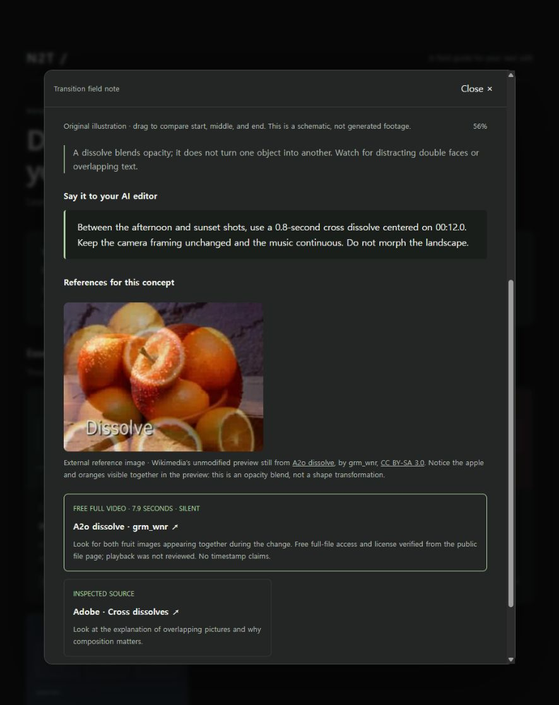

# N2T — New To This



<p align="center">
  <a href="README.md">English</a> | <a href="README.ko.md" lang="ko">한국어</a> | <a href="README.ja.md" lang="ja">日本語</a> | <a href="README.zh-CN.md" lang="zh-CN">简体中文</a>
</p>

[](LICENSE)


> Every expert was a newbie once. You don't need to learn everything. Just enough knowledge for your next quest.

전문가도 한때는 뉴비였습니다. 우리는 모든 분야의 지식을 다 알 수 없고, 새로운 일을 시작할 때마다 그 분야의 전문가가 될 필요도 없습니다.

하지만 AI에게 일을 잘 맡기려면, 내가 만들고자 하는 것에 대한 기본적인 도메인 지식은 필요합니다. 무엇을 요청해야 하는지, 어떤 조건을 전달해야 하는지, 나온 결과가 내가 원한 것인지 판단할 수 있어야 하니까요.

N2T는 그 출발점을 돕기 위해 만들었습니다. **모든 것을 배우는 대신, 지금 하려는 일에 필요한 만큼만 이해하는 것.** 낯선 분야의 핵심 개념과 용어를 조사하고, 이미지·영상·실제 사례와 함께 살펴볼 수 있는 HTML 가이드로 정리해 주는 오픈소스 AI 스킬입니다.

예를 들어 AI로 영상을 편집하고 싶다면, 편집 기술을 전부 배울 필요는 없습니다. 컷, 디졸브, 매치 컷이 무엇인지, 각각 어떤 느낌을 만드는지 알면 “자연스럽게 이어줘”보다 내가 원하는 전환을 더 구체적으로 설명할 수 있습니다.

## 가이드에는 이런 내용을 담아요

- 먼저 알아야 할 개념과 자주 쓰는 용어
- 실제 업무에서 그 개념이 쓰이는 예시와 헷갈리기 쉬운 부분
- 어디를 눈여겨보면 좋을지 짚어 주는 참고 자료와 출처
- 이제 해볼 일과 당장 몰라도 괜찮은 내용

가이드는 별도 프로그램 없이 브라우저에서 열 수 있는 HTML 파일로 만들어집니다.

필요할 때 한 번씩 불러서 쓰면 됩니다. 학습 기록을 관리하거나 정기 알림을 설정할 필요도 없습니다. 가이드 본문은 인터넷 없이 읽을 수 있지만, 연결된 이미지·영상·사이트를 보려면 인터넷이 필요할 수 있습니다.

## 필요한 개념부터 골라 보세요

상단에는 지금 하려는 퀘스트가, 아래에는 **먼저 알아야 할 것 · 다음으로 볼 것 · 나중에 봐도 될 것**으로 나눈 카드가 표시됩니다. 카드를 누르면 모달이 열리고, 짧은 설명과 관련 이미지·영상·사이트를 함께 볼 수 있습니다. 미리보기에서 클릭이 안 된다면 HTML 파일을 내려받아 브라우저로 열어 주세요.

## 어떻게 질문하나요?

아래 프롬프트로 만든 가이드입니다.

```text
$n2t I’m editing a video with AI, but I don’t know much about transitions—what should I know to describe the effects I want?
```

### 이렇게 만들어집니다

<table>
  <tr>
    <td width="33%" align="center"><a href="assets/examples/n2t-gallery-main.jpg"></a><br><sub>개념 갤러리</sub></td>
    <td width="33%" align="center"><a href="assets/examples/n2t-cross-dissolve-detail.jpg"></a><br><sub>개념 상세 설명</sub></td>
    <td width="33%" align="center"><a href="assets/examples/n2t-ai-prompt-example.jpg"></a><br><sub>AI 요청 예시와 참고 자료</sub></td>
  </tr>
</table>

스크린샷에 포함된 참고 이미지: [A2o dissolve — grm_wnr](https://commons.wikimedia.org/wiki/File:A2o_dissolve.ogv), [CC BY-SA 3.0](https://creativecommons.org/licenses/by-sa/3.0/).

## 참고 자료를 고르는 기준

- **이미지:** 개념을 이해하는 데 도움이 되는 실제 참고 이미지를 모달 안에 표시하고 출처와 볼 부분을 함께 적습니다. 자체 제작 도식은 참고 이미지와 구분합니다. 표시할 수 있는 이미지를 찾지 못했다면 그 이유를 밝힙니다.
- **영상:** 필요한 내용을 무료로 볼 수 있다고 확인한 영상만 링크합니다. 유료 강의, 구독·결제가 필요한 영상, 무료 여부를 확인하지 못한 영상은 제외합니다.
- **웹사이트:** 공식 문서와 실제 서비스를 우선 확인하고, 이번 작업과 어떤 관련이 있는지 설명합니다.

이미지는 표시 여부를 확인하고, 로딩에 실패하면 출처 안내를 남기도록 되어 있습니다. 검색이나 브라우저 검증을 사용할 수 없는 환경에서는 확인하지 못한 부분을 밝힙니다.

## 설치

[Node.js와 npm](https://nodejs.org/en/download)이 설치되어 있으면 아래 명령으로 바로 시작할 수 있습니다. [Skills CLI](https://github.com/vercel-labs/skills)는 `npx`로 실행하므로 따로 설치하지 않아도 됩니다.

터미널에서 다음 명령을 실행한 뒤, N2T를 사용할 도구를 선택하세요.

```sh
npx skills add 0AndWild/N2T
```

설치 전에 어떤 스킬이 있는지 확인하려면:

```sh
npx skills add 0AndWild/N2T --list
```

Codex와 Claude Code에 한 번에 설치하려면:

```sh
npx skills add 0AndWild/N2T --skill n2t --agent codex claude-code
```

여러 프로젝트에서 쓰려면 같은 명령에 `--global`을 붙이세요.

Claude Desktop 일반 채팅은 별도로 설치해야 합니다. `skills/n2t` 폴더 전체를 ZIP으로 압축해 Skills 설정에서 업로드하고 활성화하세요. ZIP 안에는 `n2t/SKILL.md`와 나머지 파일이 함께 있어야 합니다. [Claude 공식 Skills 안내](https://support.claude.com/en/articles/12512180-use-skills-in-claude)를 참고하세요.

스킬의 동작 방식은 `skills/n2t/SKILL.md`에, HTML 작성 기준은 `references/html-guide.md`에 담겨 있습니다.

CLI를 처음 설치하거나 설치 위치를 직접 정하고 싶다면 [자세한 설치 안내](docs/USAGE.ko.md)를 참고하세요.

## 사용하기

이미 대화에서 작업을 설명했다면 `$n2t 지금 작업에 필요한 지식을 알려줘`처럼 짧게 불러도 됩니다. 전체 배경이나 개념 이름을 미리 정리할 필요는 없습니다.

가이드를 저장할 폴더에서 Codex를 실행하세요. `--search`를 붙이면 최신 웹 자료를 검색할 수 있습니다.

```sh
codex --search
```

실행한 뒤 **Codex 대화창**에 이렇게 입력해 보세요.

```text
$n2t AI로 영상을 편집하려는데 화면 전환 효과를 잘 몰라. 컷, 디졸브, 매치 컷이 어떻게 다르고 언제 쓰면 좋은지 알려줘. AI에게 원하는 전환을 설명하는 예시와 참고 이미지, 무료 영상도 찾아서 한국어 HTML 가이드로 정리해 줘.
```

Claude Code를 사용한다면 작업 폴더에서 실행합니다.

```sh
claude
```

**Claude Code 대화창**에서는 `/n2t`로 시작하면 됩니다.

```text
/n2t AI로 영상을 편집하려는데 화면 전환 효과를 잘 몰라. 컷, 디졸브, 매치 컷이 어떻게 다르고 언제 쓰면 좋은지 알려줘. AI에게 원하는 전환을 설명하는 예시와 참고 이미지, 무료 영상도 찾아서 한국어 HTML 가이드로 정리해 줘.
```

`$n2t`와 `/n2t`는 터미널에 직접 입력하는 명령이 아니라, Codex나 Claude Code를 실행한 뒤 대화창에 입력하는 이름입니다. 무엇을 하려는지, 어느 정도 알고 있는지, 어떤 언어로 읽고 싶은지를 함께 알려주세요.

다른 분야도 같은 식으로 요청할 수 있습니다.

```text
물류 관리 대시보드를 만들어야 해. 입고·출고·재고·리드타임이 실제 업무에서 어떻게 연결되는지, 화면 설계에 필요한 만큼만 알려줘. 결과는 outputs/logistics-guide.html에 저장해줘.
```

무엇을 하려는지 아직 알 수 없다면 N2T가 먼저 물어봅니다. 참고 자료는 이해에 도움이 되는 것만 고르고, 직접 확인하지 못한 자료는 그 사실을 밝힙니다.

### 결과 확인

별도 경로를 지정하지 않으면 현재 작업 폴더의 `outputs/n2t-<작업명>.html`에 저장합니다. 실행 환경에 별도 결과물 저장 규칙이 있으면 그 규칙을 따릅니다. 완료 메시지의 링크를 열거나 파일을 브라우저로 열면 됩니다.

## 업데이트와 문제 해결

업데이트, 제거, 다른 설치 방법은 [설치 및 문제 해결](docs/USAGE.ko.md)을 참고하세요.

## 저장소 구성

```text
N2T/
├── README.md
├── README.ko.md
├── README.ja.md
├── README.zh-CN.md
├── docs/
└── skills/
    └── n2t/
        ├── SKILL.md                 # 두 에이전트가 공유하는 실행 지침
        ├── agents/
        │   └── openai.yaml          # Codex 표시 정보
        ├── assets/
        │   └── gallery-guide.html
        └── references/
            └── html-guide.md        # HTML 가이드 작성 기준
```

`agents/openai.yaml`은 Codex용 추가 메타데이터입니다. Claude Code의 실행 지침은 같은 `SKILL.md`와 참조 문서에 담겨 있으며 Codex 전용 도구에 의존하지 않습니다.

설치 안내는 2026-09-28에 확인한 공식 문서를 바탕으로 작성했습니다. 사용하는 도구와 권한에 따라 검색할 수 있는 자료와 결과물은 달라질 수 있습니다.

## 라이선스

[MIT](LICENSE) — 자유롭게 사용, 수정, 배포할 수 있습니다.
